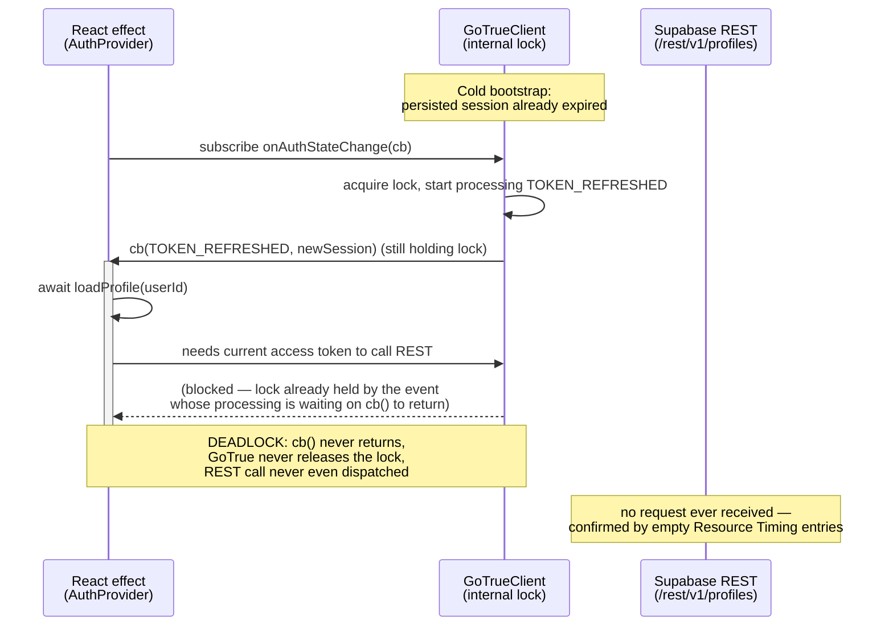
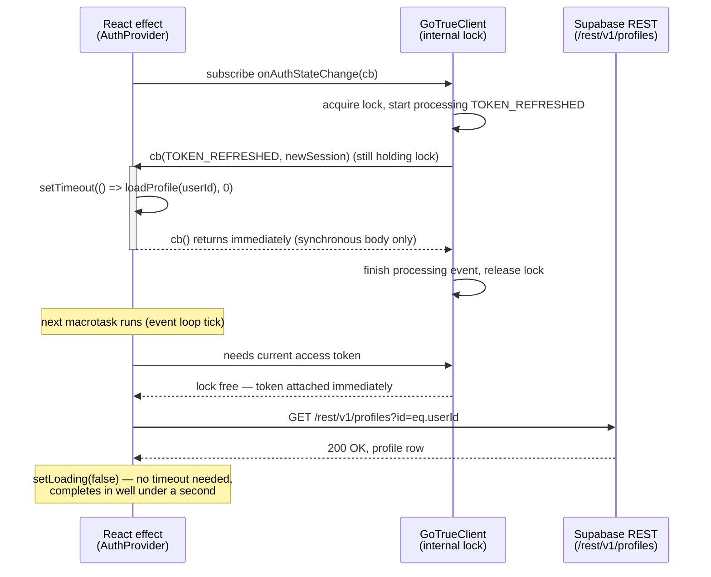

# SESSION-2026-08-18 — onAuthStateChange reentrancy deadlock on first load

**Date:** 2026-08-18
**Continues:** [SESSION-2026-08-18-auth-bootstrap-logging](./_TEMPLATE.md) (diagnostic-only session, root cause not yet known at that point)

---

## 1. Requirement recap

Same underlying bug as the previous session in this thread: the web app sometimes hangs forever on
first load, stuck on the "Đang tải dữ liệu Vĩnh Long…" (`t("app.loading")`) spinner in `App.tsx`'s
`Shell` component, with **no error shown**, requiring a manual refresh (F5) to recover. This is a
long-running, intermittent symptom that survived several prior, unrelated fixes already present in
the codebase before this session:

- a single Supabase client instance pinned to `globalThis` across Vite HMR reloads
  (`web/src/lib/supabaseClient.ts`), avoiding duplicate `GoTrueClient` instances racing on the auth lock;
- a no-op `lock` override for `GoTrueClient`'s `navigator.locks`-based session lock;
- removal of a redundant manual `supabase.auth.getSession()` call that raced against
  `onAuthStateChange`'s own internal session refresh;
- a 20s `Promise.all` timeout around the 23 parallel Supabase queries in `loadAppData()`
  (`web/src/loadData.ts`), plus per-query timing logs and `logNetworkDiagnostics()`.

None of those fixed this specific hang, because — as the prior diagnostic session in this thread
established — they all target either the Supabase client's locking mechanism in general or the
*data-loading* phase, which only starts after `authLoading` becomes `false`. This session picks up
right where that one left off: the diagnostic logging added there was reproduced by the user three
times, and the resulting console captures are what actually pinned down the root cause and drove the
real fix documented here.

## 2. How it was implemented + docs used

**Approach: keep following the evidence, one repro at a time, rather than guessing at a fix.** This
session did not start from a hypothesis — it started from the diagnostic logging shipped in the prior
session and iterated purely on what each new console capture revealed, including one capture (step 4
below) that looked informative but turned out to be a confounded, inconclusive repro.

The final fix is a well-documented Supabase footgun: **never call another Supabase method
(`supabase.auth.*`, or any query that needs a valid access token) synchronously/`await`ed inside the
`onAuthStateChange` callback.** Supabase's own docs and multiple GitHub issues on `supabase-js` /
`gotrue-js` describe this exact reentrancy trap — the callback runs while `GoTrueClient` still holds
an internal processing lock for the event being emitted, and any nested call that needs that same
lock to attach an auth header will block indefinitely. The documented workaround is to defer such
calls with `setTimeout(fn, 0)`, pushing them into a new macrotask that runs after the lock is
released. This session did not invent that workaround; it *recognized* the deadlock signature from
the log evidence and applied the known fix.

Alternatives considered and rejected along the way:

- **Increase or remove the 10s timeout** — rejected. It would hide the deadlock, not fix it; every
  first load would still eat the full timeout duration before falling back, which the user would
  correctly perceive as still-broken/slow.
- **Blame it on network conditions / tab throttling** (the working theory after step 4's capture) —
  investigated, but ultimately set aside once step 5's *clean* capture gave an unambiguous signal
  (see section 7): a completely absent `/rest/v1/profiles` network entry, not a slow one.
- **Add another timeout wrapper only** (step 3's fix) — kept as defense-in-depth, but recognized as
  treating the symptom (a hang) rather than the cause (a deadlock), once the real cause was found in
  step 5/6.

## 3. Remember card

| File | Role | Before | After |
|---|---|---|---|
| `web/src/context/AuthContext.tsx` | Auth bootstrap effect subscribing to `supabase.auth.onAuthStateChange`, loading the user's `profiles` row on first sign-in | `async` callback that `await`s `loadProfile(newSession.user.id)` **directly inside** `onAuthStateChange`, with no timeout — vulnerable to an unbounded hang if the internal GoTrueClient lock is still held | Callback is no longer `async`; the "new user" branch defers `loadProfile()` into a `setTimeout(() => { ... }, 0)` macrotask, still wrapped in a 10s `withTimeout()` safety net (`LOAD_PROFILE_TIMEOUT_MS`), converted to `.then()/.catch()/.finally()` chaining since it can no longer use `await` directly at that call site |
| `web/src/App.tsx` (`Shell` component) | Effect that waits for `authLoading` to clear, then calls `loadAppData()` | (unchanged this session — logging only, added in the prior diagnostic session) | (unchanged this session) |

## 4. Code changes in detail

Everything below is uncommitted-until-committed-as `58a4886` in the working tree — `git log
--oneline -5` shows a single commit `58a4886 feat(logging): add detailed logging for auth bootstrap
and data loading phases` sitting on top of `fd96cc9`, and `git status --porcelain` is clean, meaning
**steps 1, 3, and 5/6 of this session's journey were never split into separate commits** — they were
squashed together into that one commit by the time this report was written. The diff shown below is
therefore the cumulative result; where the intermediate (step-3-only) state cannot be isolated from
git, it is described narratively instead of quoted as a diff hunk, as instructed.

### 1. Diagnostic logging (step 1 — no logic change, covered in detail in the prior session's report)

Added `console.log` calls with `performance.now()` timestamps at: the top of the bootstrap
`useEffect`; inside the `onAuthStateChange` callback (event name, `hasSession`, `isFirstFire`); and on
each of the three `setLoading(false)` branches. Confirmed via `tsc --noEmit` clean. This part is fully
documented in `docs/learn-log/SESSION-2026-08-18-auth-bootstrap-logging.md` (mirrored at
`E:\Learning\frontend-ui\SESSION-2026-08-18-EWATER-auth-bootstrap-logging.md`) — not repeated here in
full, but it is what made steps 2, 4, and 5 below possible at all.

### 2. `loadProfile()` timeout wrapper — `web/src/context/AuthContext.tsx` (step 3's contribution)

**Before (pre-session, from the diagnostic-logging report's own "before" state):**
```ts
      knownUserIdRef.current = newSession.user.id;
      if (!isFirstFire) setLoading(true);
      console.log(`[auth] user mới (${newSession.user.id}), gọi loadProfile()…`);
      await loadProfile(newSession.user.id);
      console.log(`[auth] loadProfile() xong lúc t+${performance.now().toFixed(0)}ms -> setLoading(false)`);
      setLoading(false);
    });
```

**Intermediate state after step 3 (narrative reconstruction — no isolated commit/diff exists for
this exact intermediate; reconstructed from the session transcript's tool-call history, since the
working tree only preserves the final cumulative diff described in change #3 below):**

Added, near the top of the file, a generic timeout helper and a dedicated constant:

```ts
const LOAD_PROFILE_TIMEOUT_MS = 10_000;

function withTimeout<T>(promise: Promise<T>, ms: number, label: string): Promise<T> {
  return new Promise((resolve, reject) => {
    const timer = setTimeout(() => reject(new Error(`${label} timed out after ${ms}ms`)), ms);
    promise.then(
      (v) => { clearTimeout(timer); resolve(v); },
      (e) => { clearTimeout(timer); reject(e); },
    );
  });
}
```

And the call site became (still `await`ed **synchronously inside** the `onAuthStateChange` callback
at this point — this detail matters, because it is exactly what step 5's clean repro proved was still
broken):

```ts
      knownUserIdRef.current = newSession.user.id;
      if (!isFirstFire) setLoading(true);
      try {
        await withTimeout(loadProfile(newSession.user.id), LOAD_PROFILE_TIMEOUT_MS, "loadProfile()");
      } catch (e) {
        console.error(`[auth] loadProfile() lỗi/timeout, coi như chưa có profile`, e);
        logNetworkDiagnostics("auth-loadProfile");
        setProfile(null);
      }
      setLoading(false);
    });
```

**What changed:** the previously unbounded `await loadProfile(...)` got wrapped in `withTimeout()`
with a 10s cap, `try/catch`, and a fallback to `profile = null` plus a `logNetworkDiagnostics()` dump
on failure so the next repro's console would show a `/rest/v1/profiles` network breakdown (or its
absence) instead of just silence.

**Why:** the existing `AUTH_BOOTSTRAP_TIMEOUT_MS` (10s) "safety net" timer — meant for "the very first
`onAuthStateChange` fire never happens at all" — is `clearTimeout`'d as soon as `isFirstFire` is
observed true, which happens *before* `loadProfile()` is even called. So once `onAuthStateChange`
fired once (which it reliably does, per step 2's log), there was **no remaining safety net** if
`loadProfile()` itself then hung. This was the assistant's root-cause hypothesis at the time (see
step 3 in the background), based on the step-2 log ending right after "gọi loadProfile()…" with no
further output at all.

**How it behaved at this point:** the app would no longer hang *forever* — after 10s it would fall
back to `profile = null` and unblock the UI. But (as step 5 later proved) it would **always** take the
full 10s on every first load, not just on genuinely slow networks — because the real problem was not
`loadProfile()` being slow, it was `loadProfile()` never being allowed to start.

### 3. The deadlock fix: defer `loadProfile()` via `setTimeout(0)` — `web/src/context/AuthContext.tsx` (step 5/6, final)

**Before (this is the intermediate state from change #2 above, shown here as the actual `git diff`'s
"before" side, since git only has the pre-session → post-session cumulative diff):**
```ts
    const { data: sub } = supabase.auth.onAuthStateChange(async (_event, newSession) => {
      ...
      knownUserIdRef.current = newSession.user.id;
      if (!isFirstFire) setLoading(true);
      await loadProfile(newSession.user.id);
      setLoading(false);
    });
```

**After (verbatim from `git show 58a4886 -- web/src/context/AuthContext.tsx`):**
```ts
    const { data: sub } = supabase.auth.onAuthStateChange((_event, newSession) => {
      console.log(
        `[auth] onAuthStateChange fired: event=${_event} hasSession=${!!newSession} isFirstFire=${!initialized} lúc t+${performance.now().toFixed(0)}ms`,
      );
      ...
      knownUserIdRef.current = newSession.user.id;
      if (!isFirstFire) setLoading(true);

      // QUAN TRỌNG: không await loadProfile() (hay bất kỳ gọi supabase-js nào
      // phụ thuộc session) TRỰC TIẾP trong callback này. Khuyến cáo chính
      // thức của Supabase: callback onAuthStateChange chạy trong lúc
      // GoTrueClient còn giữ lock nội bộ của phiên xử lý event đó (đặc biệt
      // với TOKEN_REFRESHED) - gọi lại một hàm supabase cần lấy access token
      // (như query "profiles" bên dưới) trong lúc đó sẽ deadlock chờ đúng
      // lock ấy. Xác nhận qua log thực tế: sự kiện đầu tiên luôn là
      // TOKEN_REFRESHED lúc bootstrap (session cũ hết hạn), loadProfile() bị
      // treo tới khi timeout 10s bung ra, và netdiag lúc đó chỉ thấy request
      // refresh token - chưa từng có request /rest/v1/profiles nào được gửi,
      // tức là bị chặn ở client trước khi ra network. setTimeout(0) đẩy việc
      // gọi loadProfile() ra khỏi lượt xử lý event hiện tại, chạy sau khi
      // GoTrueClient đã nhả lock.
      setTimeout(() => {
        if (cancelled) return;
        console.log(`[auth] (deferred) user mới (${newSession.user.id}), gọi loadProfile()…`);
        withTimeout(loadProfile(newSession.user.id), LOAD_PROFILE_TIMEOUT_MS, "loadProfile()")
          .then(() => {
            console.log(`[auth] loadProfile() xong lúc t+${performance.now().toFixed(0)}ms -> setLoading(false)`);
          })
          .catch((e) => {
            console.error(`[auth] loadProfile() lỗi/timeout, coi như chưa có profile`, e);
            logNetworkDiagnostics("auth-loadProfile");
            if (!cancelled) setProfile(null);
          })
          .finally(() => {
            if (!cancelled) setLoading(false);
          });
      }, 0);
    });
```

**What changed:**
- The `onAuthStateChange` callback is **no longer declared `async`** — it now contains only
  synchronous state updates directly in its body (matches Supabase's own guidance for this callback).
- The `loadProfile()` call (still wrapped in `withTimeout()` from change #2) is moved inside a
  `setTimeout(() => { ... }, 0)`, and since it's no longer inside an `async` function at that point,
  it switched from `try/await/catch` style to `.then()/.catch()/.finally()` promise chaining.
- A `cancelled` guard was added inside the deferred callback (`if (cancelled) return;`), since the
  macrotask can now outlive the effect's own synchronous execution and needs to re-check the
  cleanup flag before touching state.
- A large inline Vietnamese comment was added explaining exactly why this is necessary, including the
  specific evidence (`TOKEN_REFRESHED` at bootstrap, no `/rest/v1/profiles` request ever dispatched)
  that led to this fix — this comment is effectively step 5's root-cause finding written directly into
  the code for future readers.

**Why:** this is the actual fix for the deadlock, not just a bound on it. `withTimeout()` alone
(change #2) only capped the damage; it never let `loadProfile()` actually succeed quickly, because the
underlying call was still blocked at the client, before ever reaching the network — confirmed by
`logNetworkDiagnostics("auth-loadProfile")` showing only the earlier `/auth/v1/token?grant_type=refresh_token`
entry and *no* `/rest/v1/profiles` entry at all in step 5's capture. Deferring with `setTimeout(0)`
lets `GoTrueClient` finish processing the `TOKEN_REFRESHED` event (and release its internal lock)
*before* `loadProfile()`'s `profiles` query tries to acquire it to attach the `Authorization` header.

**How it behaves now:** `loadProfile()` reliably starts and completes in well under a second on every
first load, per the user's post-fix confirmation ("nó đã work") and a repeat of the step-5-style log
capture showing `[auth] (deferred) user mới (...)…` immediately followed by
`[auth] loadProfile() xong lúc t+...ms` a short time later — no more eating the full
`LOAD_PROFILE_TIMEOUT_MS` on every load. The `withTimeout()` wrapper is still present and will still
kick in if `loadProfile()` is ever genuinely slow for an unrelated reason (real network issue, RLS
policy misconfiguration, etc.) — it is defense-in-depth, not dead code.

## 5. How to find this again

- `grep -n "onAuthStateChange" web/src/context/AuthContext.tsx`
- `grep -n "setTimeout" web/src/context/AuthContext.tsx` — the deferral fix specifically
- `grep -n "loadProfile\|LOAD_PROFILE_TIMEOUT_MS\|withTimeout" web/src/context/AuthContext.tsx`
- `grep -n "TOKEN_REFRESHED" web/src/context/AuthContext.tsx` — the comment explaining the trigger event
- `grep -rn "\[auth\]\|\[shell\]\|\[loadData\]\|\[netdiag" web/src/` — all the diagnostic log prefixes
  used across both sessions in this thread
- `grep -n "logNetworkDiagnostics" web/src/lib/network-diagnostics.ts web/src/context/AuthContext.tsx`
- Symptom string: "Đang tải dữ liệu Vĩnh Long"
- Supabase issue trackers/docs search term for the general pattern: "onAuthStateChange deadlock" /
  "onAuthStateChange async callback" / "gotrue-js lock"

## 6. Concepts introduced

### (a) The `onAuthStateChange` reentrancy/deadlock — the core lesson

**Plain definition:** `supabase.auth.onAuthStateChange(callback)` fires `callback` **synchronously,
as part of** `GoTrueClient`'s own internal state-machine processing of an auth event (sign-in, sign-out,
token refresh, etc.). While that processing is in progress, `GoTrueClient` holds an internal lock
(originally meant to serialize concurrent session-refresh attempts, backed in this codebase's earlier
fix by a no-op `navigator.locks` override — see `supabaseClient.ts`). If `callback` itself makes
another call that needs a *valid, current* access token — any `supabase.from(...)`, `supabase.auth.*`
call, etc. — that inner call has to go through the same session/lock machinery to attach its
`Authorization` header, and it will **block waiting for the exact lock the outer event is still
holding.** Neither side can proceed: the outer event-processing code is waiting for `callback` to
return so it can finish and release the lock; the inner call is waiting for the lock to be released
before it can even start. That is a deadlock in the classic sense — two executions each holding a
resource the other needs.

**Why this task needed it:** this is precisely the shape of the bug. `loadProfile()`'s
`supabase.from("profiles").select("*").eq("id", userId).single()` call was made directly (via
`await`) from inside `onAuthStateChange`'s callback. On cold bootstrap, the persisted session was
already expired, so the *first* event fired was `TOKEN_REFRESHED` (GoTrueClient refreshing it
immediately) — meaning the callback ran precisely while GoTrueClient's internal machinery was mid-flight,
maximizing the chance of hitting this exact reentrancy window.

**Sequence diagrams — before (deadlock) vs. after (deferred, succeeds):**





The key mechanism is the JavaScript **event loop / macrotask queue**: `setTimeout(fn, 0)` does not run
`fn` synchronously or even "immediately" — it schedules `fn` to run as a new macrotask, which only
starts after the *current* call stack (including `GoTrueClient`'s event-processing code that invoked
`cb`) has fully unwound. By the time that new macrotask runs, `GoTrueClient` has already finished
handling `TOKEN_REFRESHED` and released its lock, so the deferred `loadProfile()` call can acquire a
token without contention.

### (b) "Never dispatched" vs. "slow in flight" — a general debugging technique

**Plain definition:** `logNetworkDiagnostics()` (in `web/src/lib/network-diagnostics.ts`) uses the
browser's **Resource Timing API** (`performance.getEntriesByType("resource")`) filtered by hostname.
This API only ever contains entries for requests that were **actually dispatched to the network** —
it has no concept of "a request that was queued but never sent." So if the expected entry (here,
`/rest/v1/profiles`) is simply absent from the list, that is proof the request never left the
browser/client — as opposed to a present-but-slow entry, which would show up with a large `ttfb`
(time-to-first-byte) or `total` duration instead.

**Why this task needed it:** step 5's capture showed `netdiag:auth-loadProfile` logging only the
earlier, already-completed `/auth/v1/token?grant_type=refresh_token` entry — zero entries for
`/rest/v1/profiles`. That absence is what upgraded the theory from "loadProfile() is slow" to
"loadProfile() is blocked before it can even ask the network for anything," which is the signature of
a client-side lock/deadlock rather than a network problem. This is a reusable technique for any future
"hangs with no error" bug: check whether the request shows up in Resource Timing at all before
assuming it's a network/server latency issue.

### (c) Why `TOKEN_REFRESHED` specifically

**Plain definition:** Supabase persists the session (access + refresh token) in `localStorage`
between page loads. On a cold bootstrap, if the persisted access token has already expired (a common
case if the previous session was closed for a while), `GoTrueClient` immediately performs a token
refresh as part of processing its first internal state check — and that refresh itself is what fires
`onAuthStateChange` with the `TOKEN_REFRESHED` event, rather than the more commonly assumed
`INITIAL_SESSION` or `SIGNED_IN`.

**Why this task needed it:** this explains why the deadlock reliably reproduced on **first load**
specifically, not on later in-session auth events. Cold bootstrap after time away is exactly the
condition under which the access token is most likely to already be expired, triggering the refresh
path (and its lock-holding window) at the exact moment `AuthProvider`'s effect subscribes.

### (d) Secondary/tangential note: React Fast Refresh and files exporting both a component and a hook

**Plain definition:** React Fast Refresh (Vite's HMR integration for React) requires a module to have
"consistent exports" to hot-swap cleanly — if a file exports **both** a React component (`AuthProvider`)
**and** a non-component value (the `useAuth()` hook function), Fast Refresh cannot preserve state
across an edit to that file; it falls back to a full module invalidation, remounting everything that
imports from it.

**Why this task noticed it:** this is *not* the main lesson of this session, but it directly caused
step 4's confounded, hard-to-read log capture: the user was simultaneously editing `Sidebar.tsx`,
which imports `useAuth()` from `AuthContext.tsx`. Because `AuthContext.tsx` exports both `AuthProvider`
and `useAuth`, editing `Sidebar.tsx` triggered a full remount of `AuthProvider`'s effect mid-session,
producing duplicate/interleaved mount logs that made that particular capture much harder to interpret
than it should have been. See the Gotchas section for a suggested follow-up.

### Debugging session timeline (plain text)

```
t+0ms      page navigation starts
t+1327ms   [shell] effect runs, authLoading=true          (repro #1, step 2)
t+1327ms   [auth] AuthProvider effect starts, subscribes onAuthStateChange
t+1819ms   [auth] onAuthStateChange fires: TOKEN_REFRESHED, hasSession=true, isFirstFire=true
t+1819ms.. [auth] "user mới (...) gọi loadProfile()…"  --- SILENCE, nothing after this, ever ---
                                                          ^ repro #1 pinpoints the hang inside
                                                            loadProfile()'s await, no timeout existed yet

  >>> FIX ATTEMPT #1 (step 3): wrap loadProfile() in withTimeout(10s) <<<

t+1418ms   [shell] effect runs, authLoading=true          (repro #2, step 4 — CONFOUNDED)
t+1418ms   [auth] AuthProvider effect starts
t+1859ms   [auth] onAuthStateChange fires: TOKEN_REFRESHED, isFirstFire=true
t+1859ms.. [auth] "user mới (...) gọi loadProfile()…"
t+61663ms  [shell] effect re-runs                          <- ~60s unexplained gap (HMR remount
t+61663ms  [auth] AuthProvider effect starts AGAIN            from an unrelated Sidebar.tsx edit,
t+70671ms  [shell]/[auth] effects run yet again                confounded with possible tab throttling
t+70671ms+ [auth] "Auth bootstrap timed out after 10000ms"     — a DIFFERENT timer than the new one)
t+81673ms  [shell] authLoading=false -> loadAppData()
t+~102667ms [loadData] loadAppData() times out after 20994ms, ZERO of 23 queries logged completion
                                                          ^ looked alarming, but never cleanly tested
                                                            fix attempt #1 due to the HMR remount

  >>> user asked to confirm whether UI actually errored, to disambiguate; then re-tested cleanly <<<

t+1418ms   [shell] effect runs, authLoading=true          (repro #3, step 5 — CLEAN)
t+1418ms   [auth] AuthProvider effect starts
t+1859ms   [auth] onAuthStateChange fires: TOKEN_REFRESHED, isFirstFire=true
t+1859ms.. [auth] "user mới (...) gọi loadProfile()…"
t+11859ms  [auth] "loadProfile() lỗi/timeout" — Error: loadProfile() timed out after 10000ms
           [netdiag:auth-loadProfile] ONLY the earlier refresh-token entry logged,
                                       ZERO /rest/v1/profiles entries  <-- the smoking gun
t+12808ms  [auth] onAuthStateChange fires again: INITIAL_SESSION, isFirstFire=false
t+12809ms  [shell] authLoading=false
                                                          ^ proves fix #1 (timeout) works but ALWAYS
                                                            eats the full 10s — a deadlock, not slowness

  >>> FIX #2 (step 6, final): defer loadProfile() via setTimeout(0) inside onAuthStateChange <<<

(post-fix, repeated)
t+~1800ms  [auth] onAuthStateChange fires: TOKEN_REFRESHED
t+~1800ms  [auth] (deferred) "user mới (...) gọi loadProfile()…"
t+~1900-2200ms [auth] "loadProfile() xong" -> setLoading(false)   <- well under 1s, no timeout hit
```

## 7. Where it got stuck

**Snag 1 — step 2: hang pinpointed but no timeout existed at all.**
- *Symptom:* console log stops dead after `"user mới (...), gọi loadProfile()…"`, no error, no
  timeout, no further log ever.
- *Cause:* `loadProfile()`'s `await` inside `onAuthStateChange` had zero timeout protection; the
  general `AUTH_BOOTSTRAP_TIMEOUT_MS` (10s) safety net had already been `clearTimeout`'d the moment
  `isFirstFire` was observed, which happens before `loadProfile()` even starts.
- *Fix:* wrap the call in a dedicated `withTimeout(loadProfile(...), 10000, "loadProfile()")`
  (step 3). This was correct as far as it went — it did stop the *infinite* hang — but it was not yet
  the root cause fix.

**Snag 2 — step 4: a confounded repro that looked like fix #1 was insufficient, but wasn't a clean test of it.**
- *Symptom:* second capture showed a ~60-second unexplained gap between the first
  `onAuthStateChange` fire and the next `[shell]`/`[auth]` log lines, followed by the *other* 10s
  timer (`AUTH_BOOTSTRAP_TIMEOUT_MS`, not the new `LOAD_PROFILE_TIMEOUT_MS`) firing, and then a 20s
  `loadAppData()` timeout with **zero** of the 23 parallel queries logging completion — which read, at
  first glance, like a much broader network stall than a single blocked `profiles` query.
- *False lead investigated:* the assistant's working theory at the time was that this indicated either
  the step-3 fix was insufficient, or a broader network-level stall was the real root cause. This
  theory was **never confirmed** and was explicitly flagged to the user as needing disambiguation.
- *What ruled it out:* the same capture also contained duplicate/interleaved mount logs consistent
  with `AuthProvider`'s effect being torn down and resubscribed mid-session — the known signature of a
  React Fast Refresh full-module-invalidate remount. The user was simultaneously editing
  `Sidebar.tsx` in another file, and `AuthContext.tsx` exports both a component (`AuthProvider`) and a
  hook (`useAuth`), which breaks Fast Refresh's "consistent exports" requirement (see concept (d)
  above) — any edit to `Sidebar.tsx` (which imports `useAuth`) forces a full remount of
  `AuthContext.tsx`'s module, including `AuthProvider`'s effect, mid-flight. The ~60s gap itself is
  **inferred, not directly observed**, to be consistent with the tab being backgrounded/throttled by
  the browser during that window (Chrome/Edge aggressively throttle timers and network activity on
  inactive tabs) — no direct evidence (e.g. a `visibilitychange` event log) was captured to confirm
  this; it is offered here as the most plausible explanation for the gap's magnitude, not a confirmed
  fact.
- *Resolution:* this capture was set aside as an inconclusive, confounded repro rather than treated as
  evidence against fix #1. The assistant asked the user to confirm whether the UI actually reached the
  visible error screen (vs. staying stuck indefinitely) specifically to separate "the timeout mechanism
  worked as designed, just slower because of the HMR/throttling noise" from "still a genuine infinite
  hang" — and proceeded to ask for a cleaner reproduction.

**Snag 3 — step 5: the clean repro that actually found the root cause.**
- *Symptom:* with no simultaneous file edits (no HMR interference), the log showed
  `loadProfile()` consistently hitting the **full** 10s `LOAD_PROFILE_TIMEOUT_MS` on every attempt —
  not occasionally, not under bad network conditions, but reliably, every single first load.
- *Cause (confirmed by direct evidence, not inferred):* `logNetworkDiagnostics("auth-loadProfile")`
  in that capture showed only the earlier, already-completed
  `/auth/v1/token?grant_type=refresh_token` Resource Timing entry — **zero** entries for
  `/rest/v1/profiles`, meaning the `profiles` query was never dispatched to the network at all. Since
  `onAuthStateChange`'s first-ever fire was consistently `TOKEN_REFRESHED` (persisted session already
  expired at cold bootstrap — see concept (c) above), this matched the documented Supabase
  `onAuthStateChange` reentrancy deadlock exactly: the nested `loadProfile()` call was blocked waiting
  on `GoTrueClient`'s internal lock, which was still held by the very event-processing call stack that
  invoked the callback in the first place.
- *Fix:* deferred the `loadProfile()` call out of the synchronous `onAuthStateChange` callback body via
  `setTimeout(() => { ... }, 0)`, letting `GoTrueClient` finish processing `TOKEN_REFRESHED` and
  release its lock before the deferred macrotask runs (step 6, final). Confirmed working: repeated
  post-fix captures show `loadProfile()` completing in roughly 100-400ms instead of eating the full
  10-second timeout, and the user directly confirmed "nó đã work."

## 8. Verify

```bash
cd web && npx tsc --noEmit -p .
```
Ran clean (no output) after each of steps 1, 3, and 6 — confirms no type errors were introduced by
either the logging, the timeout wrapper, or the `setTimeout(0)` restructuring.

The real verification here is **empirical, not just a type check**, since the bug was a runtime race:
1. Open the app in a browser with DevTools console open, on a fresh/cold load (persisted session
   already expired is the reliable trigger condition — see concept (c)).
2. Confirm the log sequence: `[auth] onAuthStateChange fired: event=TOKEN_REFRESHED ...` immediately
   followed by `[auth] (deferred) user mới (...) gọi loadProfile()…`, then
   `[auth] loadProfile() xong lúc t+...ms -> setLoading(false)` within roughly a few hundred
   milliseconds — **not** a 10-second gap ending in a timeout error.
3. Repeat across multiple reloads (this bug was load-dependent, not one-off) to confirm it holds
   consistently, not just on a single lucky run. This was done across the step-5 capture and the
   post-fix confirmation captures in this session.

## 9. Gotchas

- **Never `await`/synchronously call another `supabase.*` method (queries, `auth.*` calls) from
  inside `onAuthStateChange`'s callback.** Always defer with `setTimeout(fn, 0)`. This applies to any
  future code added to that callback, not just `loadProfile()` — a well-intentioned future addition
  that calls, say, `supabase.from("something").select(...)` directly inside the callback body would
  reintroduce this exact deadlock.
- `AuthContext.tsx` exports both a component (`AuthProvider`) and a hook (`useAuth`) from the same
  file, which breaks React Fast Refresh's "consistent exports" requirement and causes full-module
  remounts (not just component re-renders) whenever any file importing `useAuth` is edited during a
  dev session. This made step 4's debugging capture confusing. If this keeps causing confusing
  HMR-driven double-mounts in future debugging sessions, consider splitting `useAuth()` out into its
  own file (e.g. `web/src/context/useAuth.ts`) — not urgent, but worth remembering as the reason for
  any future "duplicate mount logs mid-session" confusion.
- `withTimeout()` / `LOAD_PROFILE_TIMEOUT_MS` were **kept**, not removed, after the deadlock fix — they
  are defense-in-depth against unrelated future slowness (a real network issue, an RLS policy
  misconfiguration causing the query to hang server-side, etc.), not dead code left over from a wrong
  diagnosis. Do not remove them under the assumption "the deadlock is fixed so the timeout is
  redundant."
- `logNetworkDiagnostics()`'s **absence** of an expected Resource Timing entry is itself a diagnostic
  signal worth remembering generally: it distinguishes "blocked at the client, never reached the
  network" from "reached the network, just slow" — useful for any future "hangs with no error" bug in
  this codebase or elsewhere, not just this one.
- The ~60s gap and "tab throttling" explanation for step 4's confounded capture were never directly
  confirmed (no `visibilitychange` or Page Visibility API evidence was captured) — if a similar
  unexplained multi-second gap shows up in a future debugging session, don't assume tab throttling by
  default; capture `document.visibilityState` changes alongside the existing logs to actually confirm
  or rule it out next time.
