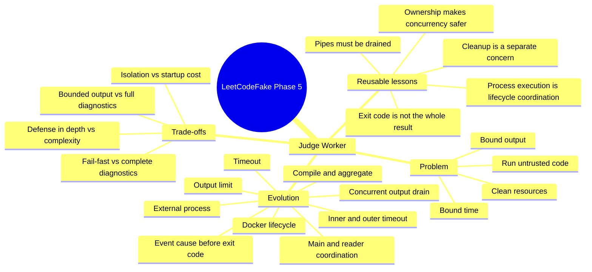

# Phase 5 Judge Worker mind map

```mermaid
mindmap
  root((LeetCodeFake Phase 5))
    Judge Worker
      Problem
        Run untrusted code
        Bound time
        Bound output
        Clean resources
      Evolution
        External process
        Timeout
        Concurrent output drain
        Output limit
        Main and reader coordination
        Event cause before exit code
        Inner and outer timeout
        Docker lifecycle
        Compile and aggregate
      Trade-offs
        Fail-fast vs complete diagnostics
        Bounded output vs full diagnostics
        Defense in depth vs complexity
        Isolation vs startup cost
      Reusable lessons
        Process execution is lifecycle coordination
        Pipes must be drained
        Exit code is not the whole result
        Ownership makes concurrency safer
        Cleanup is a separate concern
```

